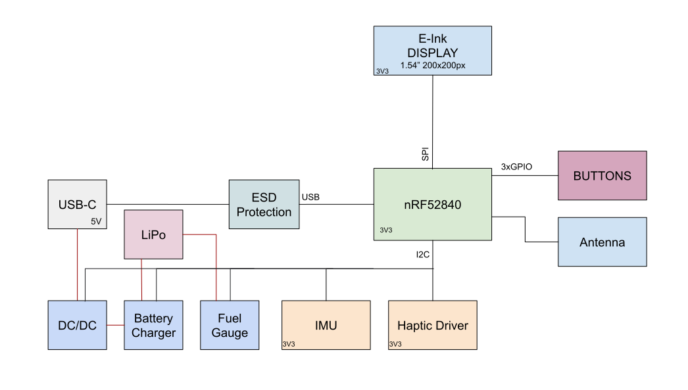
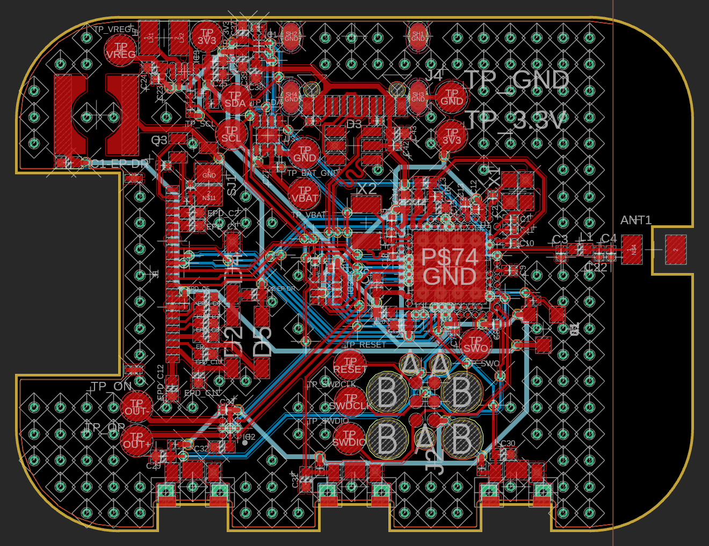
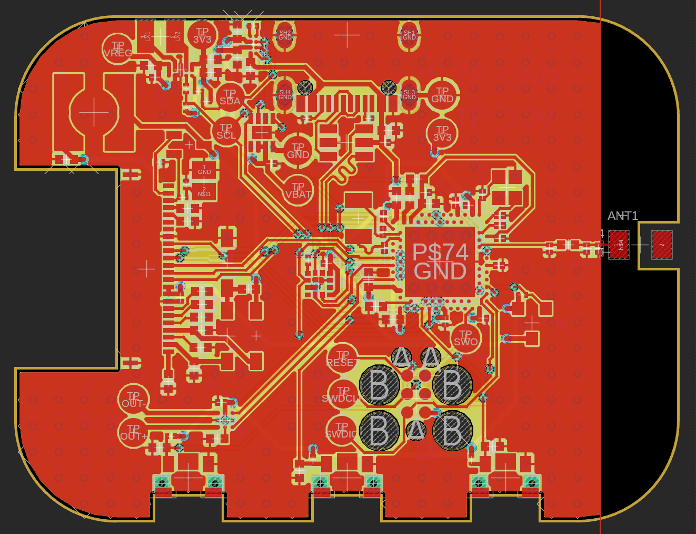
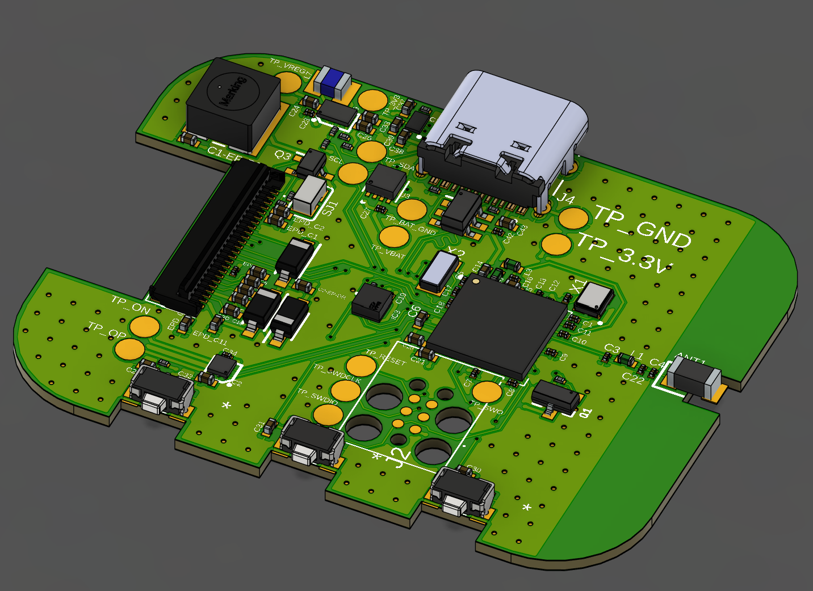
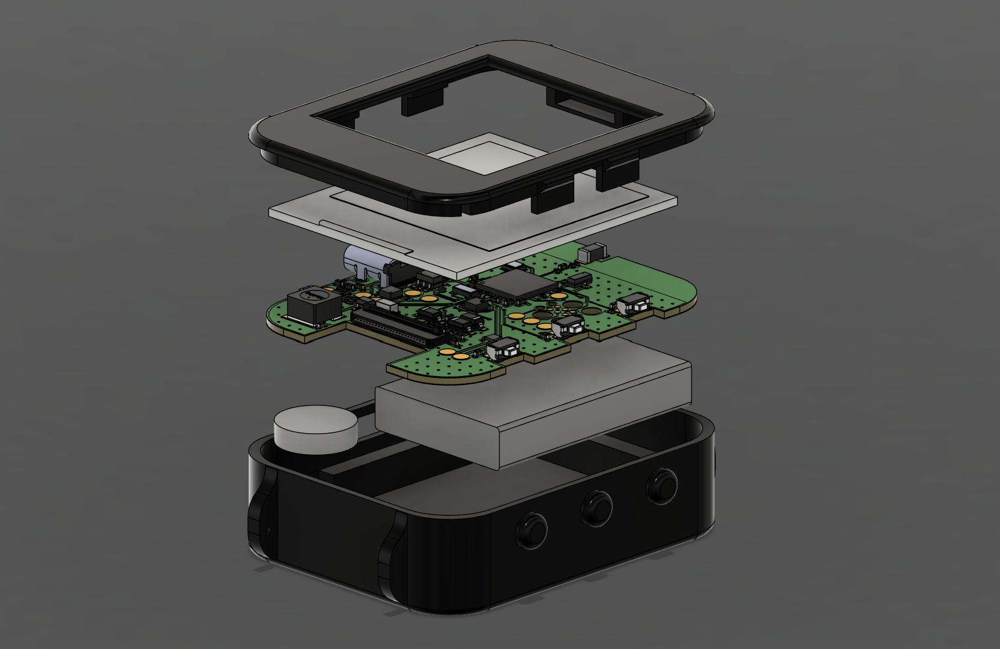
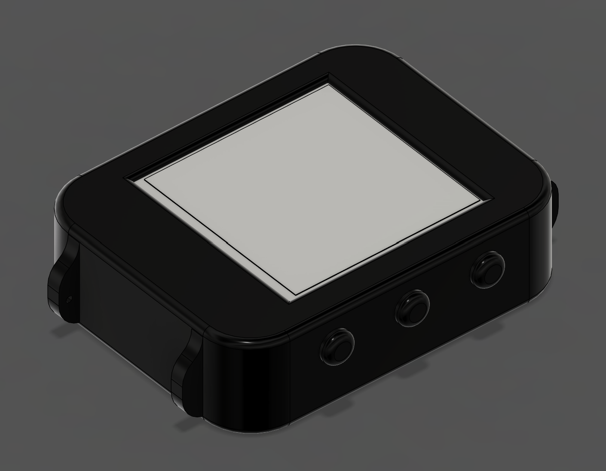
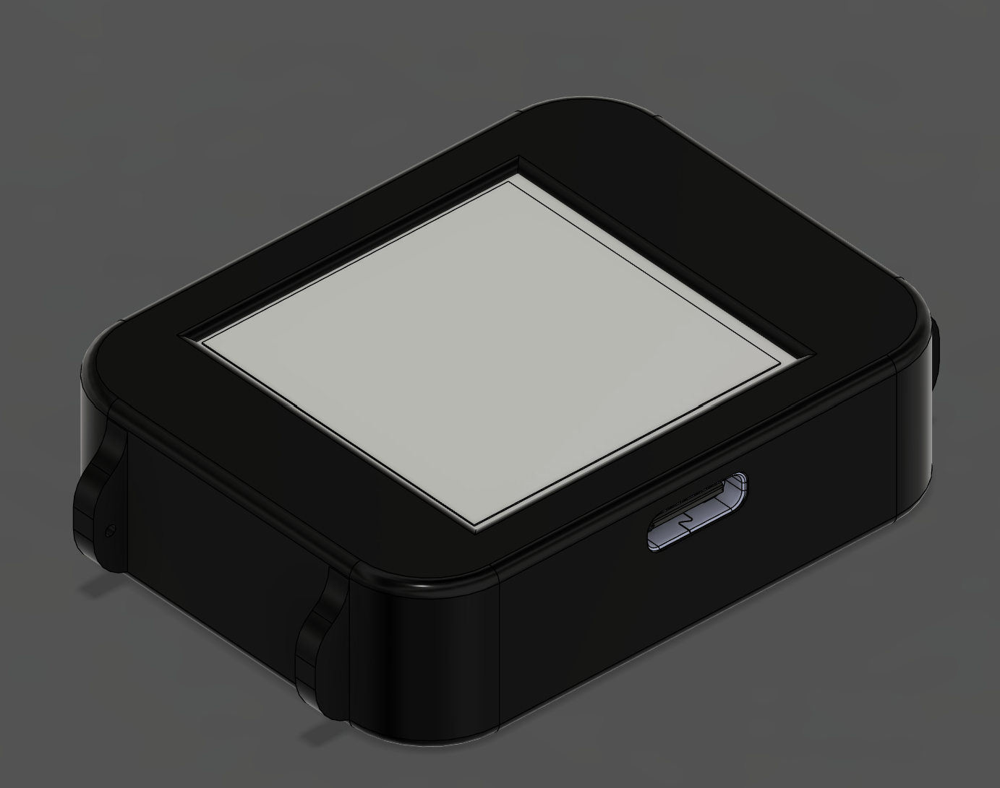

# InkTime

## Overview

InkTime is an open-source smartwatch project that aims to provide a customizable and feature-rich wearable device,
powered by the Nordic nRF52840 SoC. The device is designed to be energy-efficient, featuring a 1.54-inch e-ink display,
a 250mAh battery, an IMU for motion tracking, and a haptic driver for tactile feedback.

## Hardware Diagram

## Bill of Materials

| Quantity | Component         | Package      | Producer / Part            | Link         | Datasheet         |
|----------|-------------------|--------------|----------------------------|--------------|-------------------|
| 1        | SoC               | aQFN-73      | Nordic / nRF52840-QIAA     | [Link](TODO) | [Datasheet](TODO) |
| 1        | PMIC              | BGA-8        | TI / BQ25180YBGR           | [Link](TODO) | [Datasheet](TODO) |
| 1        | PMIC              | WLCSP-15     | Richtek / RT6160AWSC       | [Link](TODO) | [Datasheet](TODO) |
| 1        | Fuel Gauge IC     | TDFN-8       | Analog Devices / MAX17048  | [Link](TODO) | [Datasheet](TODO) |
| 1        | ESD Protection IC | SOT-23-6     | ST / USBLC6-2SC6Y          | [Link](TODO) | [Datasheet](TODO) |
| 1        | Haptic Driver     | BGA-9        | TI / DRV2605YZFR           | [Link](TODO) | [Datasheet](TODO) |
| 1        | IMU               | 12-pin LGA   | Bosch / BMA423             | [Link](TODO) | [Datasheet](TODO) |
| 1        | Antenna           | 3216 (1206)  | Johanson / 2.45GHz Antenna | [Link](TODO) | [Datasheet](TODO) |
| 1        | Connector         | FPC-24       | Molex / EPD Connector      | [Link](TODO) | [Datasheet](TODO) |
| 1        | Connector         | SMT          | Kinghelm / KH-TYPE-C-16P   | [Link](TODO) | [Datasheet](TODO) |
| 3        | Switch            | SMT (Button) | Panasonic / Tactile SW     | [Link](TODO) | [Datasheet](TODO) |
| 3        | Diode             | SOD-123      | ON Semi / MBR0530          | [Link](TODO) | [Datasheet](TODO) |
| 1        | N-MOSFET          | SC-70-3      | Vishay / SI1308EDL         | [Link](TODO) | [Datasheet](TODO) |
| 1        | P-MOSFET          | SOT-23       | Diodes Inc / DMG2305UX-7   | [Link](TODO) | [Datasheet](TODO) |

| Quantity | Component | Value     | Package | Producer | Link                                                                     | Datasheet                                                                                                                                                                                                                                                                                                                                                                                                                                                                                                                                                                                                                                                                                                                                                                                                                                                                                                                                                                                                                                                                                                                                                                                                                                                                              |
|----------|-----------|-----------|---------|----------|--------------------------------------------------------------------------|----------------------------------------------------------------------------------------------------------------------------------------------------------------------------------------------------------------------------------------------------------------------------------------------------------------------------------------------------------------------------------------------------------------------------------------------------------------------------------------------------------------------------------------------------------------------------------------------------------------------------------------------------------------------------------------------------------------------------------------------------------------------------------------------------------------------------------------------------------------------------------------------------------------------------------------------------------------------------------------------------------------------------------------------------------------------------------------------------------------------------------------------------------------------------------------------------------------------------------------------------------------------------------------|
| 1        | Jumper    | -         | SMD     | -        | [Link](TODO)                                                             | [Datasheet](TODO)                                                                                                                                                                                                                                                                                                                                                                                                                                                                                                                                                                                                                                                                                                                                                                                                                                                                                                                                                                                                                                                                                                                                                                                                                                                                      |
| 3        | Resistor  | 0         | 0201    | -        | [Link](TODO)                                                             | [Datasheet](TODO)                                                                                                                                                                                                                                                                                                                                                                                                                                                                                                                                                                                                                                                                                                                                                                                                                                                                                                                                                                                                                                                                                                                                                                                                                                                                      |
| 1        | Resistor  | 0.47R     | 0201    | -        | [Link](TODO)                                                             | [Datasheet](TODO)                                                                                                                                                                                                                                                                                                                                                                                                                                                                                                                                                                                                                                                                                                                                                                                                                                                                                                                                                                                                                                                                                                                                                                                                                                                                      |
| 1        | Resistor  | 2.2R      | 0201    | -        | [Link](TODO)                                                             | [Datasheet](TODO)                                                                                                                                                                                                                                                                                                                                                                                                                                                                                                                                                                                                                                                                                                                                                                                                                                                                                                                                                                                                                                                                                                                                                                                                                                                                      |
| 2        | Resistor  | 3.3K      | 0201    | -        | [Link](TODO)                                                             | [Datasheet](TODO)                                                                                                                                                                                                                                                                                                                                                                                                                                                                                                                                                                                                                                                                                                                                                                                                                                                                                                                                                                                                                                                                                                                                                                                                                                                                      |
| 2        | Resistor  | 5.1K      | 0201    | -        | [Link](TODO)                                                             | [Datasheet](TODO)                                                                                                                                                                                                                                                                                                                                                                                                                                                                                                                                                                                                                                                                                                                                                                                                                                                                                                                                                                                                                                                                                                                                                                                                                                                                      |
| 6        | Resistor  | 10K       | 0201    | -        | [Link](TODO)                                                             | [Datasheet](TODO)                                                                                                                                                                                                                                                                                                                                                                                                                                                                                                                                                                                                                                                                                                                                                                                                                                                                                                                                                                                                                                                                                                                                                                                                                                                                      |
| 3        | Capacitor | N.C.      | 0201    | -        | -                                                                        | ** -                                                                                                                                                                                                                                                                                                                                                                                                                                                                                                                                                                                                                                                                                                                                                                                                                                                                                                                                                                                                                                                                                                                                                                                                                                                                                   |
| 2        | Capacitor | 1pF       | 0201    | -        | [Link](TODO)                                                             | [Datasheet](TODO)                                                                                                                                                                                                                                                                                                                                                                                                                                                                                                                                                                                                                                                                                                                                                                                                                                                                                                                                                                                                                                                                                                                                                                                                                                                                      |
| 1        | Capacitor | 820pF     | 0201    | -        | [Link](TODO)                                                             | [Datasheet](TODO)                                                                                                                                                                                                                                                                                                                                                                                                                                                                                                                                                                                                                                                                                                                                                                                                                                                                                                                                                                                                                                                                                                                                                                                                                                                                      |
| 4        | Capacitor | 12pF      | 0201    | -        | [Link](TODO)                                                             | [Datasheet](TODO)                                                                                                                                                                                                                                                                                                                                                                                                                                                                                                                                                                                                                                                                                                                                                                                                                                                                                                                                                                                                                                                                                                                                                                                                                                                                      |
| 1        | Capacitor | 100pF     | 0201    | -        | [Link](TODO)                                                             | [Datasheet](TODO)                                                                                                                                                                                                                                                                                                                                                                                                                                                                                                                                                                                                                                                                                                                                                                                                                                                                                                                                                                                                                                                                                                                                                                                                                                                                      |
| 1        | Capacitor | 47nF      | 0201    | -        | [Link](TODO)                                                             | [Datasheet](TODO)                                                                                                                                                                                                                                                                                                                                                                                                                                                                                                                                                                                                                                                                                                                                                                                                                                                                                                                                                                                                                                                                                                                                                                                                                                                                      |
| 9        | Capacitor | 100nF     | 0201    | -        | [Link](TODO)                                                             | [Datasheet](TODO)                                                                                                                                                                                                                                                                                                                                                                                                                                                                                                                                                                                                                                                                                                                                                                                                                                                                                                                                                                                                                                                                                                                                                                                                                                                                      |
| 1        | Capacitor | 0.1uF/50V | 0201    | -        | [Link](TODO)                                                             | [Datasheet](TODO)                                                                                                                                                                                                                                                                                                                                                                                                                                                                                                                                                                                                                                                                                                                                                                                                                                                                                                                                                                                                                                                                                                                                                                                                                                                                      |
| 7        | Capacitor | 1uF       | 0402    | -        | [Link](TODO)                                                             | [Datasheet](TODO)                                                                                                                                                                                                                                                                                                                                                                                                                                                                                                                                                                                                                                                                                                                                                                                                                                                                                                                                                                                                                                                                                                                                                                                                                                                                      |
| 9        | Capacitor | 1uF/50V   | 0402    | -        | [Link](TODO)                                                             | [Datasheet](TODO)                                                                                                                                                                                                                                                                                                                                                                                                                                                                                                                                                                                                                                                                                                                                                                                                                                                                                                                                                                                                                                                                                                                                                                                                                                                                      |
| 5        | Capacitor | 4.7uF     | 0402    | -        | [Link](TODO)                                                             | [Datasheet](TODO)                                                                                                                                                                                                                                                                                                                                                                                                                                                                                                                                                                                                                                                                                                                                                                                                                                                                                                                                                                                                                                                                                                                                                                                                                                                                      |
| 1        | Capacitor | 4.7uF/25V | 0402    | -        | [Link](TODO)                                                             | [Datasheet](TODO)                                                                                                                                                                                                                                                                                                                                                                                                                                                                                                                                                                                                                                                                                                                                                                                                                                                                                                                                                                                                                                                                                                                                                                                                                                                                      |
| 3        | Capacitor | 10uF      | 0402    | -        | [Link](TODO)                                                             | [Datasheet](TODO)                                                                                                                                                                                                                                                                                                                                                                                                                                                                                                                                                                                                                                                                                                                                                                                                                                                                                                                                                                                                                                                                                                                                                                                                                                                                      |
| 2        | Capacitor | 22uF      | 0402    | -        | [Link](TODO)                                                             | [Datasheet](TODO)                                                                                                                                                                                                                                                                                                                                                                                                                                                                                                                                                                                                                                                                                                                                                                                                                                                                                                                                                                                                                                                                                                                                                                                                                                                                      |
| 1        | Inductor  | 3.9nH     | 0402    | -        | [Link](TODO)                                                             | [Datasheet](TODO)                                                                                                                                                                                                                                                                                                                                                                                                                                                                                                                                                                                                                                                                                                                                                                                                                                                                                                                                                                                                                                                                                                                                                                                                                                                                      |
| 1        | Inductor  | 470nH     | 1008    | Cjiang   | [Link](https://jlcpcb.com/partdetail/6763488-FTC252012SR47MBCA/C5832368) | [Datasheet](https://jlc-prod-smt.oss-eu-central-1.aliyuncs.com/smtDataManualFile/8602848214240948224-C5832368.pdf?response-content-disposition=attachment%3B%20filename%3DC5832368.pdf%3B%20filename%2A%3DUTF-8%27%27C5832368.pdf&x-oss-date=20260420T155325Z&x-oss-expires=1800&x-oss-security-token=CAISgAN1q6Ft5B2yfSjIr5rSCtj%2Fo6dC%2BbGGNkGChjMYerl0mf2akzz2IHhMdHJsAOodtv0%2FmmhT6PkclqRLcbhpcmfjV%2BZHzLB8qYFskT1z4J7b16cNrbH4M4H6aXeirtuwDsz9SNTCALjPD3nPii50x5bjaDymRCbLGJaViJlhHLN1Ow6jdmhpCctxLAlvo9NgFxm3D%2Fu2NQPwiWf9FVdhvhEG6Vly8qOi2MaRmFy8yFTx0b0SvJ%2BjYMrmPctoN9JnSdC5mfdzau3a1TJ84gRD0a5wkaVA1zbDs5bfISEIuUzebreLqY03dV4mOvdqIcMe8qigz88fk%2FfIioH6xyxKOexoSCnFTOiiupCcQLPyao9jLu6iayqViY7QaIOTqQohZmkAMwVOasAsI3Ngh4zF97Qt0cVNkXO9gWfLI8DtuMleWoroXextznSgc5lCkRRYwGs1287ugXlSQzo890KPDAEovaKCnZ2ZSfh7Y4sNknI6i%2Bfc2Se2MIkIM0KR4aKWD5sagAFKmiegLXY5feEbLYeCAmVE74YudDbqKoQ88ESR1e%2B42dXounyOYCRSYvo%2FT572eiHhDatupWrWOYBuvJfZpePknbuE8s%2B9jEg9KM0kWXFXEacIIbF5TeTZBNtRDJxsy02ORP5MUB9y8Q1uyuTYfNhwCQ%2B5T3JbDOX0%2BPOrZrTLbSAA&x-oss-signature-version=OSS4-HMAC-SHA256&x-oss-credential=STS.NYgAbKNxcNsm4g3b3Mv6Xv81q%2F20260420%2Feu-central-1%2Foss%2Faliyun_v4_request&x-oss-signature=a349516f90567f817aa69e514ac3e996d2db1f907bb8816a9e576956e31e9d0f) |
| 1        | Inductor  | 10uH      | 0402    | -        | [Link](TODO)                                                             | [Datasheet](TODO)                                                                                                                                                                                                                                                                                                                                                                                                                                                                                                                                                                                                                                                                                                                                                                                                                                                                                                                                                                                                                                                                                                                                                                                                                                                                      |
| 1        | Inductor  | 15uH      | 0402    | -        | [Link](TODO)                                                             | [Datasheet](TODO)                                                                                                                                                                                                                                                                                                                                                                                                                                                                                                                                                                                                                                                                                                                                                                                                                                                                                                                                                                                                                                                                                                                                                                                                                                                                      |
| 1        | Inductor  | 68uH      | 4848    | Wurth    | [Link](TODO)                                                             | [Datasheet](https://www.we-online.com/components/products/datasheet/744043003.pdf)                                                                                                                                                                                                                                                                                                                                                                                                                                                                                                                                                                                                                                                                                                                                                                                                                                                                                                                                                                                                                                                                                                                                                                                                     |
| 1        | Crystal   | 32.768kHz | SMD     | Nordic   | [Link](TODO)                                                             | [Datasheet](TODO)                                                                                                                                                                                                                                                                                                                                                                                                                                                                                                                                                                                                                                                                                                                                                                                                                                                                                                                                                                                                                                                                                                                                                                                                                                                                      |
| 1        | Crystal   | 32MHz     | SMD     | Nordic   | [Link](TODO)                                                             | [Datasheet](TODO)                                                                                                                                                                                                                                                                                                                                                                                                                                                                                                                                                                                                                                                                                                                                                                                                                                                                                                                                                                                                                                                                                                                                                                                                                                                                      |

## SoC pin configuration

- **P$AD22 (SWO)** - connection to TP_SWO for debugging
- **P$AA24 (SWDCLK)** - connection for SWD, for the purpose of clock debugging
- **P$AC24 (SWDIO)** - SWD input/output connection
- **P$AC13 (RESET)** - connection to TP_RESET and SWD for resetting the component
- **P$Y23 (P1.01)** - E-Paper Drive Circuit
- **P$AD12 (EPD_BUSY)** - indicates whether the screen is busy displaying or not
- **P$AD10 (EPD_DC)** - E-Paper Display Data/Command selection for SPI connection
- **P$K2 (EPD_CS)** - E-Paper Display Chip Select (SPI)
- **P$AD12 (EPD_RST)** - E-Paper Display Reset for SPI connection
- **P$P13 (MOSI)** - data for screen SPI connection
- **P$A12 (SCK)** - clock for screen SPI connection
- **P$L1 (SDA)** - I2C data for PMIC, Fuel Gauge, IMU
- **P$M2 (SCL)** - I2C clock for PMIC, Fuel Gauge, IMU
- **P$AD8 (P0.13)** - GPIO for the up button.
- **P$AC9 (P0.14)** - GPIO for the middle button.
- **P$W24 (P1.02)** - GPIO for the down button.
- **P$AD6 (D+)** - positive differential trace to the ESD Protection
- **P$AD4 (D-)** - negative differential trace to the ESD Protection
- **P$AD2 (VBUS)** - connection to the VBUS signal of the USB-C Connector
- **P$U1 (HAPTIC_EN)** - Haptic Driver enable/disable
- **P$T2 (PMIC_INT)** - PMIC LiPo battery interrupt
- **P$N1 (IMU_INT1)** - IMU interrupt
- **P$P2 (IMU_INT2)** - IMU interrupt
- **P\$F2 & P$D2** - 32 kHz clock
- **P\$A23 & P$A24** - 32 MHz clock
- **P$J24 (ALERT)** - Fuel Gauge circuit alert
- **P\$H23 & P$F23** - wireless transmission via the antenna

## PCB Layout

### Stackup

1. Signal and Power
2. Ground Plane
3. Power
4. Signal

Thickness: 1mm

- solder mask: 0.0254mm
- surface finish: Hasl 0.02mm
- copper weight: 1oz
- layers: 0.035mm
- outer dielectrics: 0.128mm
- inner dielectric: 0.5132mm

Via Stitching

- drill: 0.35mm diameter
- spacing: 1.8mm
- offset: 0.6mm from the edge of the board

### Component Placement

The **antenna** is placed close to the right edge of the board, with a cutout in the copper pours on the entire right
side of the board. There is also a cutout in the PCB itself under the unconnected pad of the antenna.  
The **PI** network is placed as close as possible to the antenna, an additional capacitor may be placed to better tune
the antenna.  
Light propagates at around half its speed in a vacuum in FR4. A simple calculation gives a value of around:

$$\frac{\lambda}{4} = \frac{c_{FR4}}{4f} \approx \frac{1.4 \times 10^8 m/s}{4 \times 2.4 \times 10^9 Hz} \approx 14.6 mm$$

The trace connecting the PI network to the nRF52840 pin is 5mm long, thus the antenna should work properly.  
It would be better to use a grounded coplanar waveguide for the trace, maybe calculate the width using JLCPCB's online
calculator and use one of their layer stackups instead of the one described above, but this should suffice
for a first iteration of the board.

The decoupling capacitors are placed as possible to the power pins of the IC components and in between the power line
and the pin itself.  
The crystals are also placed close to the pins of the SoC, with the load capacitors traces matched in length and as
short as possible.  
The inductor for the E-Paper Drive Circuit is placed far from any signal lines to avoid interference, even though
it is in a shielded package.

### Approved Errors

Most of the errors are related to drill sizes or blind to micro via ratios. These are all approved since, although it
will be more expensive to manufacture, JLCPCB is still able to drill the holes and make the vias.  
Thus these kind of errors can be safely ignored.

Since the nRF52840 is a BGA package, some of the pins *must* have vias in the pad. Some of these cause Fusion to give
a copper clearance error, but, again, JLCPCB is able to manufacture the board so they can also be approved.

## Mechanical Design

The buzzer is placed on the back of the board, in the lower left corner (when worn on the left wrist).

